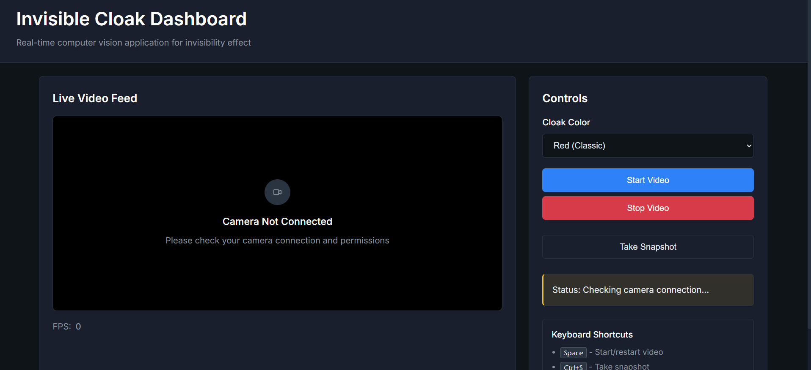

# Invisible Cloak (Harry Potter Effect)

This project uses OpenCV and computer vision to create a real-time "invisible cloak" effect, inspired by Harry Potter's invisibility cloak. When a colored cloth (red by default) is shown to the camera, it gets replaced by the background, making the person appear invisible.

## 🎯 Features

- **Real-time invisibility effect** using computer vision
- **Multiple cloak colors** (Red, Blue, Green)
- **Two versions available:**
  - Standalone desktop application
  - Professional web dashboard with modern UI
- **Keyboard shortcuts** for easy control
- **Background capture** system for seamless effect
- **Snapshot functionality** to save invisible moments

## 🚀 Quick Start

### Prerequisites

- Python 3.7 or higher
- Webcam/Camera
- Red cloth or fabric (for the cloak effect)

### Installation

1. Clone the repository:

```bash
git clone https://github.com/imakshug/Invisible-Cloak-Python.git
cd Invisible-Cloak-Python
```

2. Install dependencies:

```bash
pip install -r requirements.txt
```

## 📱 Usage Options

### Option 1: Standalone Application (Recommended)

Run the desktop version:

```bash
python main.py
```

**How to use:**

1. Make sure you're **NOT** in front of the camera when starting
2. The app will capture the background for 3 seconds
3. After "Background captured" message, sit in front of camera
4. Use your red cloth/cloak to see the invisibility effect
5. Press `q` to quit

### Option 2: Web Dashboard

Run the web version:

```bash
python app.py
```

Then open your browser and go to: `http://localhost:5000`

<div align="center">
  
  <p><em>Professional web interface with real-time video feed and control panel</em></p>
</div>

**Features:**

- Professional dark-themed interface
- Real-time video feed
- Color selection (Red/Blue/Green)
- Snapshot capture
- FPS monitoring
- Keyboard shortcuts:
  - `Space` - Start/restart video
  - `Ctrl+S` - Take snapshot
  - `Esc` - Stop video

## 🎨 How It Works

1. **Background Capture**: Records the scene without the person
2. **Color Detection**: Identifies the colored cloak in HSV color space
3. **Masking**: Creates a mask for the detected color areas
4. **Replacement**: Replaces masked areas with the captured background
5. **Real-time Processing**: Applies the effect to each video frame

## 🛠️ Technical Details

- **Computer Vision**: OpenCV for image processing
- **Color Space**: HSV for better color detection
- **Morphological Operations**: Noise reduction and mask refinement
- **Web Framework**: Flask for the dashboard version
- **Frontend**: HTML, CSS, JavaScript with modern responsive design

## 📋 Requirements

```
opencv-python
numpy
flask
```

## 🎭 Tips for Best Results

1. **Solid colored cloth** works best (bright red recommended)
2. **Good lighting** improves color detection
3. **Stable background** during capture phase
4. **Stay out of view** during the 3-second background capture
5. **Cover yourself completely** with the cloth for full invisibility

## 🔧 Troubleshooting

### Camera Issues

- **Error -1072875772**: Camera is being used by another application
  - Close Zoom, Teams, Skype, Chrome tabs with camera access
  - Check Windows Camera privacy settings
  - Try the standalone version first

### Color Detection Issues

- Adjust lighting conditions
- Try different colored cloth
- Ensure cloth is bright and solid colored

## 🤝 Contributing

1. Fork the repository
2. Create a feature branch (`git checkout -b feature/amazing-feature`)
3. Commit your changes (`git commit -m 'Add amazing feature'`)
4. Push to the branch (`git push origin feature/amazing-feature`)
5. Open a Pull Request

## 📝 License

This project is open source and available under the [MIT License](LICENSE).

## 🎉 Demo

The invisible cloak effect works by:

- Capturing a clean background
- Detecting your colored cloak in real-time
- Replacing the cloak areas with the background
- Creating a seamless invisibility effect

**Enjoy your magical invisibility powers!** ✨
